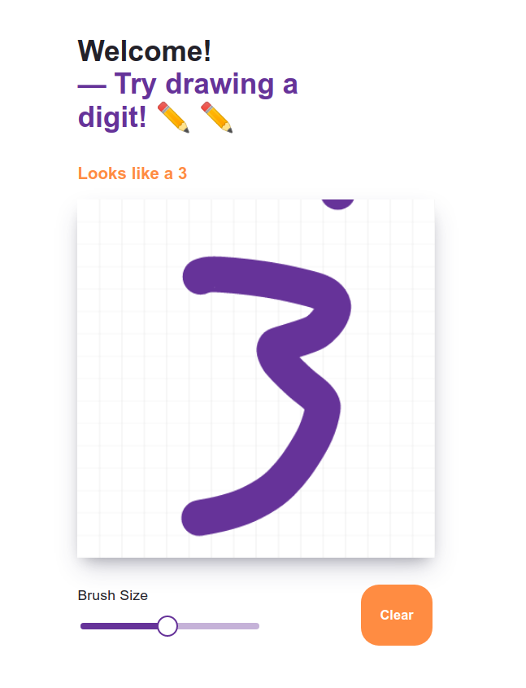
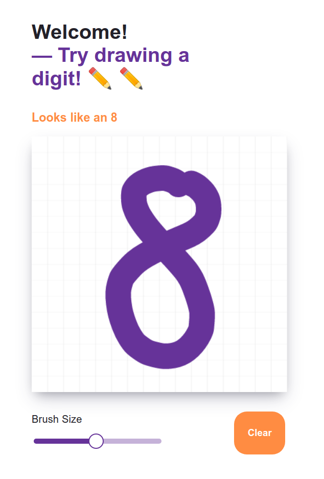
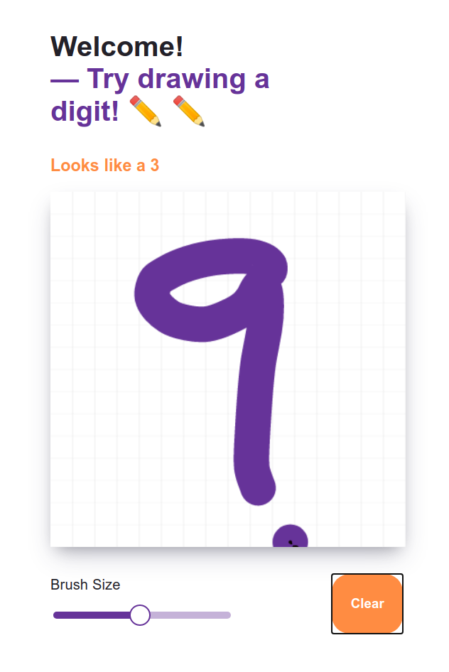

<h1 align="center">
  Digit doodle guesser
</h1>

- ## 🤔 **What is this?**
  
  On this site you can draw a digit and the machine learing algorithm will guess what you have drawn. The app is deployed with Heroku and is available [here](https://www.doodleguesser.com/)! However you can also run it locally by following these steps:
- ## 🚀 **Installation**
  1. Firstly, clone the repository: `git clone https://github.com/thdb-theo/doodle-guessing/`
  2. Then, locate the directory and the start the server with `npm run develop`
  3. Lastly, enter the directory `src/api` and the start the backend server with `python listener.py`. Make sure you have installed all the necessary requirements.
  4. Now you can go to `localhost:8000` in your favourite webbrowser and start drawing!

  #### 🔨 **Requirements**
  - npm
  - tensorflow & keras
  - scikit-image
  - numpy

- ## 💪 **How it works**

  The classifier uses a machine learning algorithm called a [Convolutional Neural Network](https://en.wikipedia.org/wiki/Convolutional_neural_network) (CNN). The model has been trained using the [MNIST](http://yann.lecun.com/exdb/mnist/) database of 60000 handwritten digits.

  When you draw a digit, we send the data to a separate server using a HTTPS requst. The server is written in Python which parses the data and transforms the drawing to a matrix. Unfortunately, the size of the canvas (400x400) and the size of the training images (28x28) is vastly different. To scale down the image, we use [bilinear intorpolation](https://en.wikipedia.org/wiki/Bilinear_interpolation). We send the scaled down image through the classifier which guesses what digit was drawn.

- ## 👀 **Examples**

  Hooray! It guessed correctly! 🎉 🎉

  
  
  

  However, noone is perfect 🤷

  

